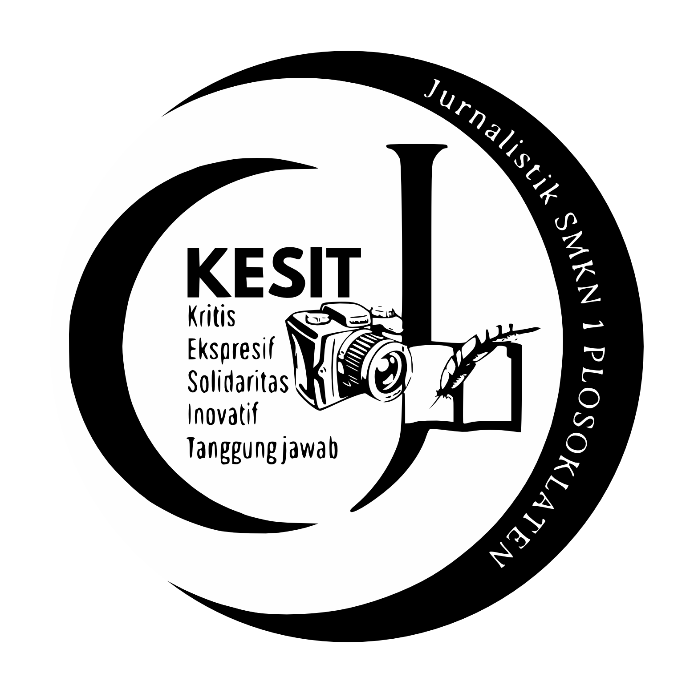

## About Suara Kesit
Suara Kesit is a journalist platform for a school journalist organization named Kesit in State Vocational High School 1 Plosoklaten. This platform's main purpose is to provide news and stories about school-related events and local community events. It's also intended to provide reading material and improve school students literacy  skills. This platform has many features, including:
- Ease of user registration for both journalist organization members and non-members. 
- Role separation between basic user and author.
- Write, share, and comment on posts.
- Post-publication curation to ensure content quality. 
- Personified user interest through the post category. 
- Platform analytical report in the administrator dashboard to analyze user behavior.
